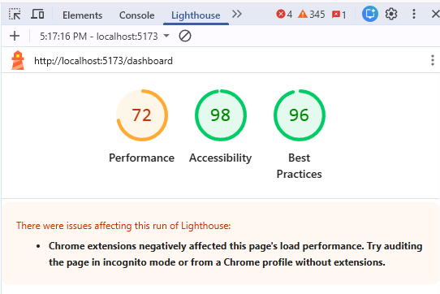
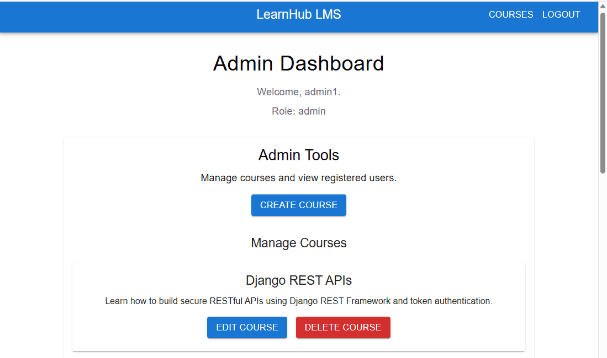
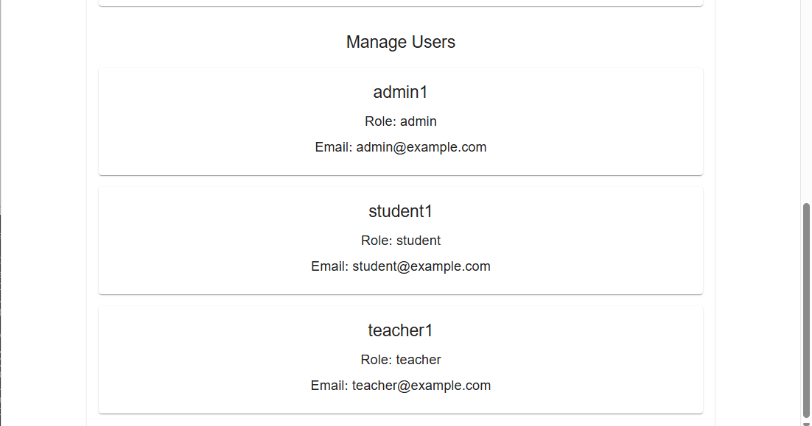
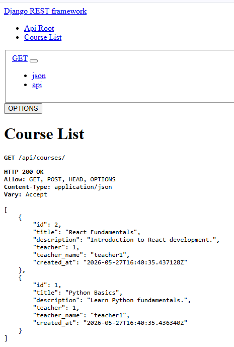
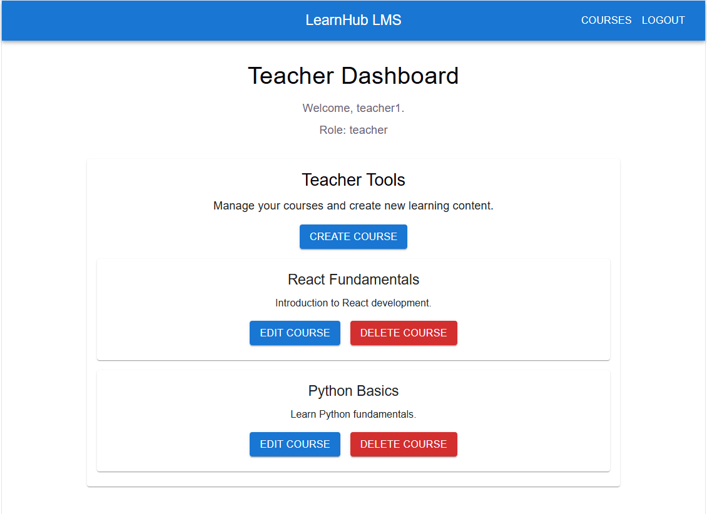
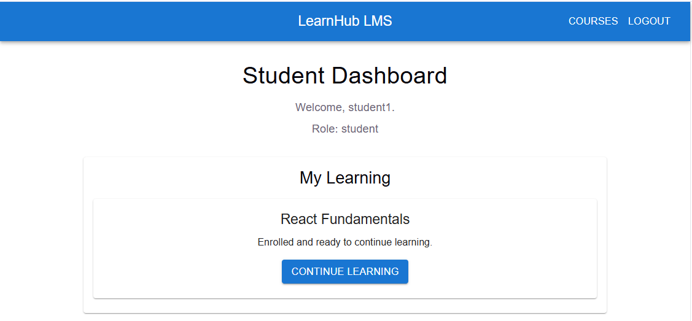
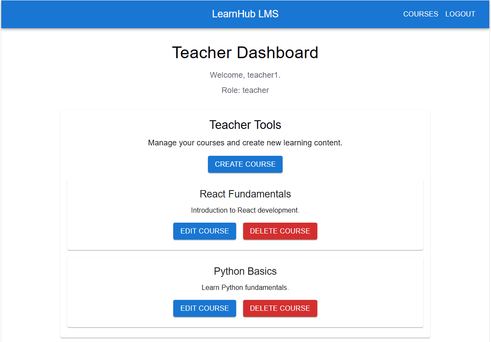
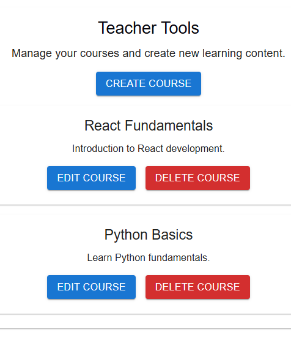
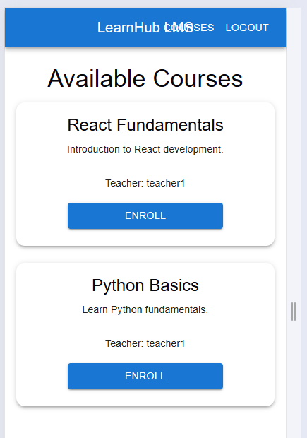

# LearnHub LMS

> **Full-Stack Learning Management System built with Django REST Framework and React**

🌐 **Live Demo:** https://learnhub-lms-alan.netlify.app

📸 **Screenshots:** Scroll down to the Screenshots section below.

---

## Project Overview

LearnHub LMS is a full-stack Learning Management System built with Django REST Framework and React. It demonstrates the design and development of a modern web application, enabling teachers to create and manage courses while students can browse, enrol and manage their learning through a secure, responsive interface.

The project showcases secure authentication, REST API development, role-based access control, responsive user interface design, accessibility improvements, CRUD functionality, automated testing and deployment using a modern full-stack architecture.

## Key Achievements

- Full-stack Django + React application
- REST API integration using Django REST Framework
- Secure token-based authentication and protected routes
- Student, Teacher, and Admin role workflows
- Full CRUD course management
- Enrollment system with real-time UI updates
- Responsive Material UI interface
- Lighthouse Accessibility Score: 100
- Automated backend and frontend testing
- Deployed using Railway and Netlify
- Structured Git commit history and documentation

---

## Live Deployment

### Frontend

https://learnhub-lms-alan.netlify.app

### Backend API

https://learnhub-lms-production-985e.up.railway.app/api/courses/

---

## Demo Accounts

### Teacher Account

Username: teacher1
Password: password123

### Student Account

Username: student1
Password: password123

### Admin Account

Username: admin1
Password: password123

---

## Features

### Teacher Features

- Teacher login authentication
- Create new courses
- Edit existing courses
- Delete courses
- Teacher dashboard
- Course management tools

### Student Features

- Student login authentication
- Browse available courses
- Enroll in courses
- Unenroll from courses
- Student learning dashboard
- Continue Learning workflow

### Admin Features

- Admin login authentication
- Admin dashboard
- View all registered users
- Manage all courses
- Create courses
- Edit courses
- Delete courses

### General Features

- Protected routes
- Role-based access control
- Snackbar feedback notifications
- Responsive Material UI design
- Accessibility improvements
- Semantic HTML structure
- Production build testing
- Lighthouse accessibility optimisation

---

## Technologies Used

| Category       | Technologies                                      |
| -------------- | ------------------------------------------------- |
| Frontend       | React, Vite, React Router, Material UI            |
| Backend        | Django, Django REST Framework                     |
| Database       | SQLite                                            |
| Authentication | Token Authentication                              |
| Testing        | Vitest, React Testing Library, Django APITestCase |
| Tools          | Git, GitHub, Lighthouse, VS Code                  |

## External Libraries

The project uses several external libraries to improve development efficiency, user experience, and testing.

### Material UI (MUI)

Used to provide responsive, accessible, and professionally styled React components such as buttons, forms, cards, alerts, and navigation elements.

### React Router

Used for client-side routing and navigation between pages including login, dashboard, courses, and course detail views.

### Django REST Framework

Used to build RESTful API endpoints for authentication, users, courses, and enrollments.

### Vitest

Used to implement automated frontend component testing.

### React Testing Library

Used to test React components from the user's perspective and verify UI behaviour.

## Testing

### Automated Testing

#### Django API Tests

Implemented using Django REST Framework APITestCase.

Tests include:

- Course list endpoint returns data correctly
- Authenticated teacher can create a course

Result:

- 2 automated API tests passed successfully

#### React Component Testing

Implemented using:

- Vitest
- React Testing Library

Tests include:

- Login page renders correctly
- Username field renders
- Password field renders
- Login button renders

Result:

- 1 component test passed successfully

### Manual UI Testing

- Authentication testing
- Course CRUD workflow testing
- Enrollment testing
- Unenrollment testing
- Student dashboard testing
- Teacher dashboard testing
- Admin dashboard testing
- User management testing
- Protected route testing
- HTML structure validation
- CSS responsive layout testing
- Mobile device testing
- Accessibility testing
- Lighthouse accessibility testing
- Production deployment testing

### Test Results

All automated and manual tests completed successfully.

- Django API Tests: Passed
- React Component Tests: Passed
- Responsive Design Tests: Passed
- Accessibility Tests: Passed
- Authentication Tests: Passed
- CRUD Workflow Tests: Passed

---

## Installation

### Clone Repository

```bash
git clone https://github.com/Alan-Baum/learnhub-lms.git
cd learnhub-lms
```

### Backend Setup

```bash
cd backend
venv\Scripts\activate
pip install -r requirements.txt
python manage.py migrate
python manage.py runserver
```

### Frontend Setup

```bash
cd frontend
npm install
npm run dev
```

---

## User Roles

### Teacher Account

Teachers can:

- Create courses
- Edit courses
- Delete courses
- Manage learning content

### Student Account

Students can:

- Browse courses
- Enroll in courses
- Unenroll from courses
- Access enrolled learning content

### Admin Account

Administrators can:

- View all registered users
- Manage all courses
- Create courses
- Edit courses
- Delete courses
- Access the Admin Dashboard

---

## Accessibility

Accessibility improvements were implemented throughout the application including:

- Semantic heading hierarchy
- Main landmark structure
- Improved button labels
- Dialog accessibility
- Snackbar feedback improvements
- Keyboard-friendly interactions

### Lighthouse Results

- Accessibility: 100
- Best Practices: 96

---

## Responsive Design

The application uses Material UI's responsive layout system and breakpoint-based styling to adapt across different screen sizes.

Responsive improvements include:

- Course cards display cleanly across mobile, tablet, and desktop devices
- Dashboard layouts remain readable on smaller screens
- The navigation bar adapts for mobile devices to prevent text overlap
- Forms and buttons resize appropriately across different screen sizes
- Mobile production testing was completed and documented

Evidence of responsive testing is included in the responsive mobile production screenshot within this repository.

## Screenshots

### User Login

The secure login page provides authenticated access for students, teachers and administrators.


---

### Teacher Login

Teachers can securely sign in to access course management features through their dedicated teacher account.


---

### Teacher Course Management

Teachers can create, edit and delete courses through a simple, intuitive interface designed for efficient course administration.


---

### Create Course Page


---

### Edit Course Page


---

### Student Dashboard

Students can access their personalised learning dashboard to view enrolled courses and continue their learning journey.


---

### Course Detail Page

Students can view detailed course information, including the course description, teacher and enrolment status before continuing their learning.


---

### Login Validation Feedback

The application provides clear, real-time feedback for failed login attempts, helping users identify authentication errors quickly and improving the overall user experience.


---

### Course Detail Dashboard Navigation

Students can easily return to their dashboard after viewing course information, providing a simple and intuitive navigation experience.


---

### Lighthouse Accessibility Audit

The application was evaluated using Google Lighthouse to identify accessibility improvements and validate compliance with modern web accessibility standards.



---

### Lighthouse Accessibility Score

Following the recommended accessibility improvements, the application achieved a Lighthouse Accessibility score of 100, demonstrating compliance with recognised web accessibility best practices.


---

### Courses Page Polished Layout

The redesigned Courses page presents available courses in a clean, card-based layout, making it easy for students to browse course information, view enrolment status, and access learning content.


---

### Student Dashboard Enrolled Courses

The student dashboard provides a personalised learning space where enrolled courses are displayed, allowing students to quickly resume their studies through the Continue Learning feature.


---

### Teacher Dashboard Polished

The teacher dashboard provides a dedicated workspace for course management, enabling teachers to create new courses and manage learning content through a simple, role-based interface.


---

### Green Enrolled Button State

The application provides a clear visual indicator when a student is enrolled, replacing the enrolment action with a green Enrolled status to improve usability and reduce confusion.


---

### Centered Enrolment Confirmation

After successfully enrolling in a course, the application displays a centred confirmation notification, providing immediate feedback that the enrolment was completed successfully.


---

### Production Admin Dashboard

The administrator dashboard provides full management capabilities, allowing administrators to create, edit and delete courses while overseeing the learning platform through a dedicated administrative interface.



---

### User Management

The administrator user management interface enables administrators to view and manage registered users, supporting secure role-based administration of the learning platform.



---

### Django REST API Production

The deployed Django REST Framework API provides secure RESTful endpoints for course management and authentication, demonstrating the production backend services that power the LearnHub LMS application.



---

### Production Teacher Dashboard

The live production teacher dashboard demonstrates the deployed application, allowing teachers to create, edit and manage courses through the production environment.



---

### Production Student Dashboard

The live production student dashboard provides students with access to their enrolled courses, allowing them to continue learning through the deployed LearnHub LMS application.



---

### Full Stack Production Application

The fully deployed LearnHub LMS demonstrates the complete production application, showcasing role-based dashboards, live course management, and the integrated React frontend with Django REST Framework backend.



---

### Course CRUD Functionality

Teachers can perform complete Create, Read, Update and Delete (CRUD) operations on courses through an intuitive management interface, demonstrating full course lifecycle management within the application.



---

### Responsive Mobile Production View

The deployed application adapts seamlessly to mobile devices, providing a responsive interface that maintains usability and accessibility across different screen sizes.



---

### Production Admin Dashboard

The production administrator dashboard provides full administrative control, enabling course management and platform oversight through the live deployed LearnHub LMS application.


---

### Production Admin User Management

The production administrator user management interface enables administrators to view registered users and manage role-based access within the live LearnHub LMS application.


---

## Testing

### Automated Testing

#### Django API Tests

Implemented using Django REST Framework APITestCase.

Tests include:

- Course list endpoint returns data correctly
- Authenticated teacher can create a course

Result:

- 2 automated API tests passed successfully

#### React Component Testing

Implemented using:

- Vitest
- React Testing Library

Tests include:

- Login page renders correctly
- Username field renders
- Password field renders
- Login button renders

Result:

- 1 component test passed successfully

### Manual Testing

- CRUD workflow testing
- Authentication testing
- Enrollment testing
- Role-based dashboard testing
- Responsive layout testing
- Lighthouse accessibility testing
- Production build testing

---

## Future Improvements

- Course search functionality
- User profile management
- Progress tracking
- File uploads
- Instructor analytics
- Course categories

---

## Author

Alan Baum

Learning People Full Stack Software Development Student
