# LearnHub LMS

## Project Overview

LearnHub LMS is a full-stack Learning Management System built with Django REST Framework and React. The application allows teachers to create and manage courses while students can browse and enroll in available learning content.

The project demonstrates full-stack web development skills including authentication, API development, frontend routing, responsive UI design, accessibility improvements, and CRUD functionality.

## Key Achievements

- Full-stack Django + React application
- REST API integration using Django REST Framework
- Authentication and protected routes
- Teacher and student role workflows
- Full CRUD course management
- Enrollment system with real-time UI updates
- Responsive Material UI interface
- Lighthouse Accessibility Score: 100
- Production build successfully tested
- Structured Git commit history and documentation

---

## Features

### Teacher Features

- Teacher login authentication
- Create new courses
- Edit existing courses
- Delete courses
- Teacher dashboard
- Course management tools

### Student Features

- Student login authentication
- Browse available courses
- Enroll in courses
- Student learning dashboard
- Continue Learning workflow

### General Features

- Protected routes
- Snackbar feedback notifications
- Responsive Material UI design
- Accessibility improvements
- Semantic HTML structure
- Production build testing
- Lighthouse accessibility optimisation

---

## Technologies Used

| Category       | Technologies                           |
| -------------- | -------------------------------------- |
| Frontend       | React, Vite, React Router, Material UI |
| Backend        | Django, Django REST Framework          |
| Database       | SQLite                                 |
| Authentication | Token Authentication                   |
| Tools          | Git, GitHub, Lighthouse, VS Code       |

### Frontend

- React
- Vite
- React Router
- Material UI (MUI)

### Backend

- Django
- Django REST Framework
- SQLite

### Tools

- Git
- GitHub
- Lighthouse
- VS Code

---

## Installation

### Clone Repository

```bash
git clone https://github.com/Alan-Baum/learnhub-lms.git
cd learnhub-lms
```
### Backend Setup

```bash
cd backend
venv\Scripts\activate
pip install -r requirements.txt
python manage.py migrate
python manage.py runserver
```

### Frontend Setup

```bash
cd frontend
npm install
npm run dev
```

---

## User Roles

### Teacher Account

Teachers can:

- Create courses
- Edit courses
- Delete courses
- Manage learning content

### Student Account

Students can:

- Browse courses
- Enroll in courses
- Access enrolled learning content

---

## Accessibility

Accessibility improvements were implemented throughout the application including:

- Semantic heading hierarchy
- Main landmark structure
- Improved button labels
- Dialog accessibility
- Snackbar feedback improvements
- Keyboard-friendly interactions

### Lighthouse Results

- Accessibility: 100
- Best Practices: 96

---

## Screenshots

### Login Page

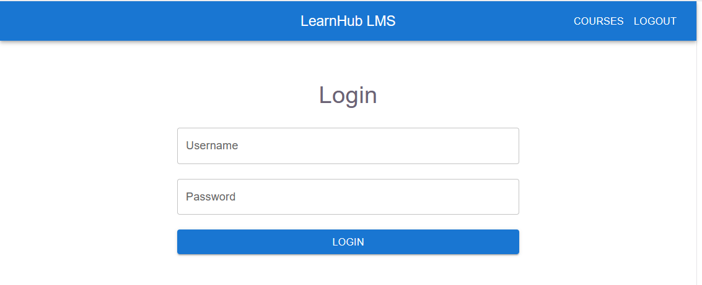

---

### Teacher Dashboard

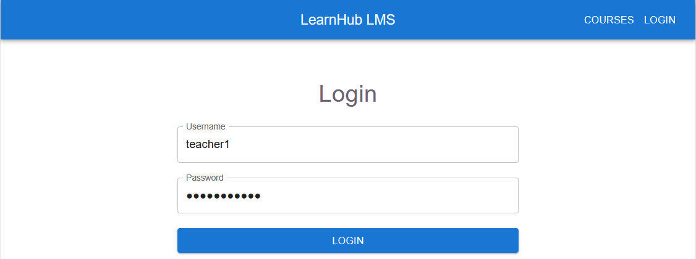

---

### Teacher Course Management

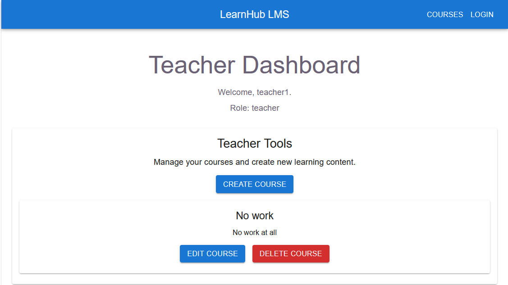

---

### Create Course Page

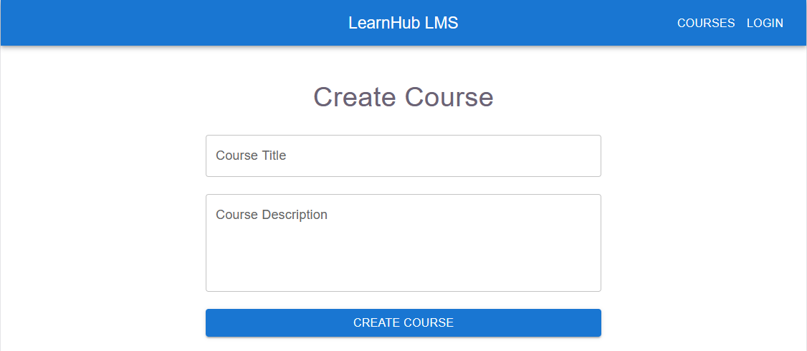

---

### Edit Course Page

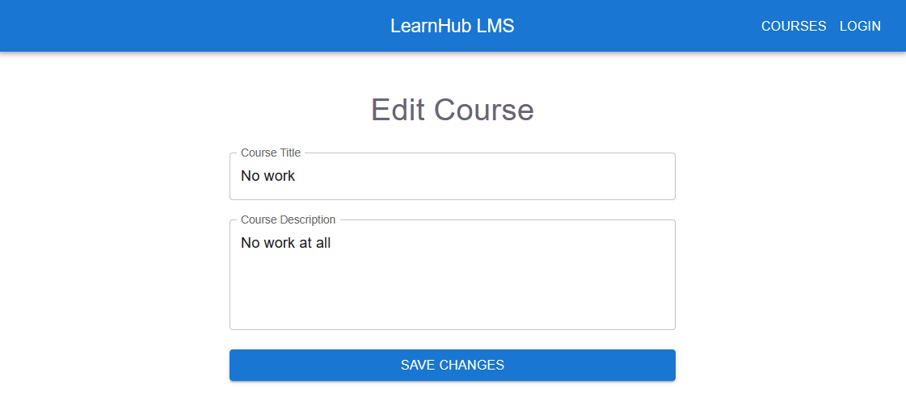

---

### Student Dashboard

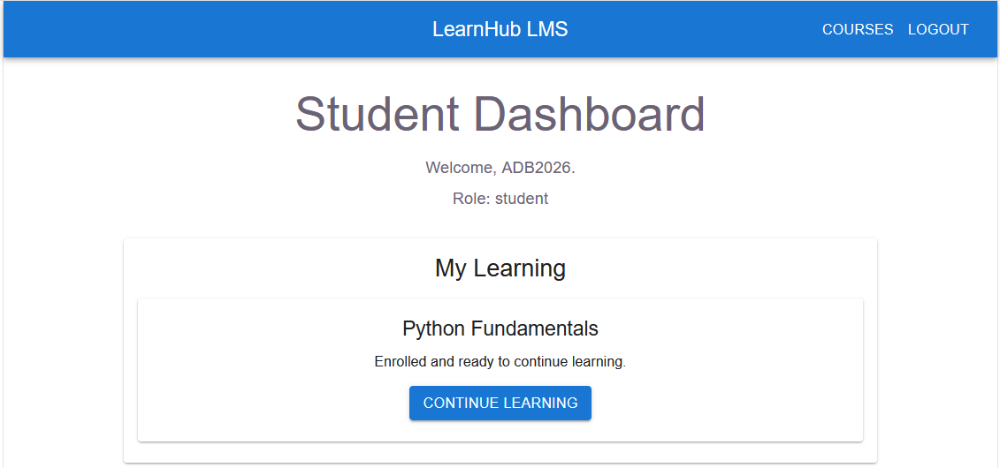

---

### Course Detail Page

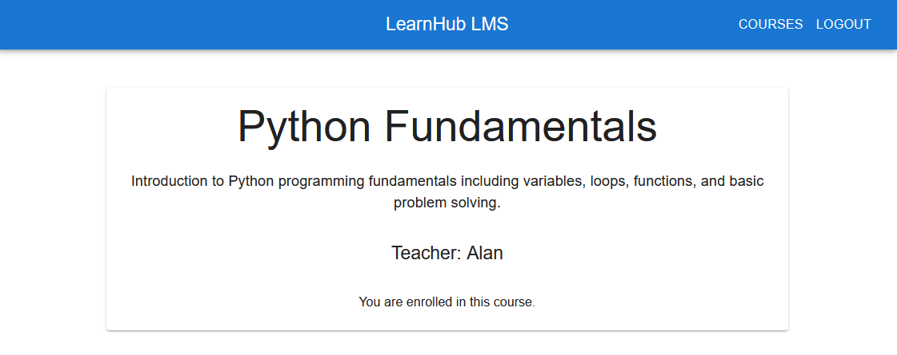

---

### Login Snackbar Feedback

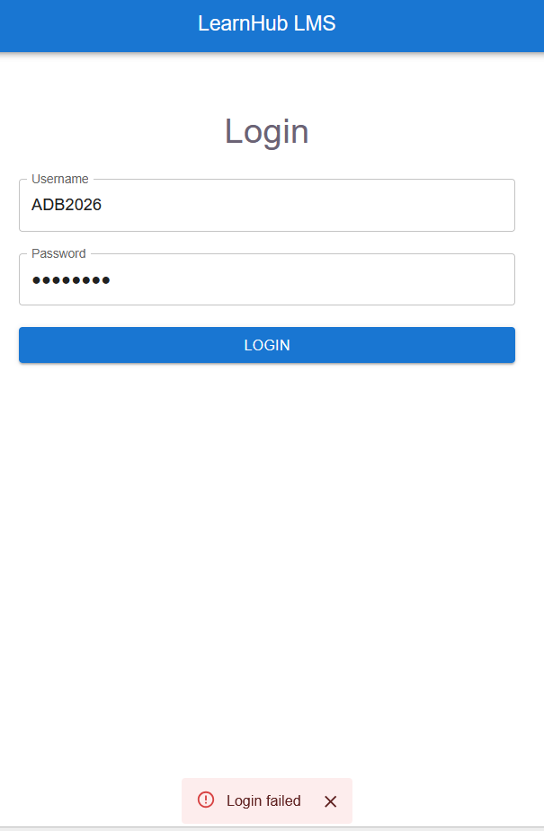

---

### Course Detail Dashboard Navigation

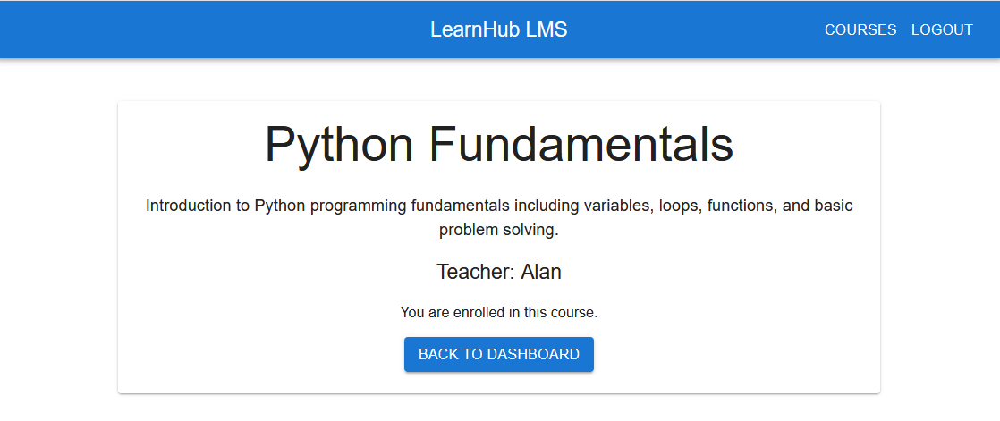

---

### Lighthouse Accessibility Audit


---

### Lighthouse Accessibility Score

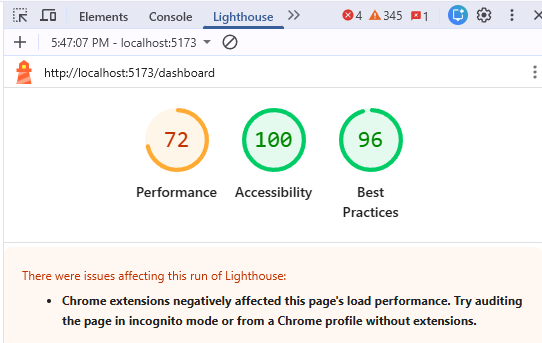

---

### Courses Page Polished Layout

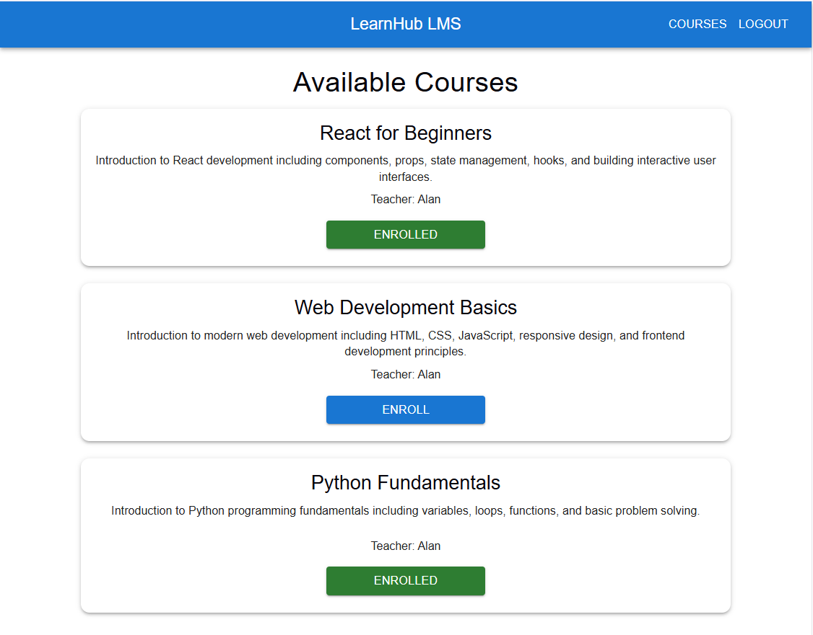

---

### Student Dashboard Enrolled Courses

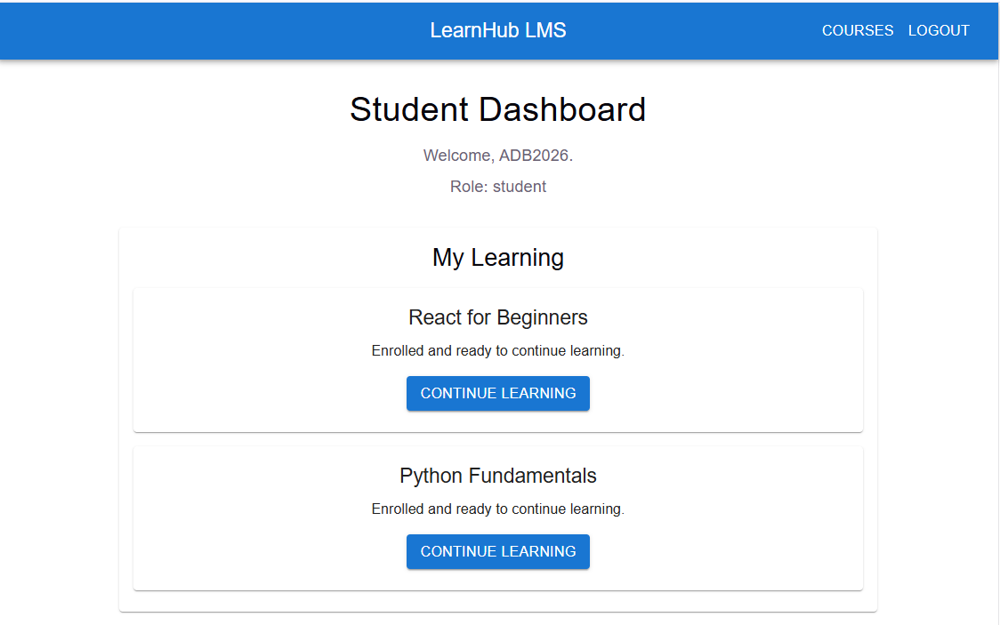

---

### Teacher Dashboard Polished

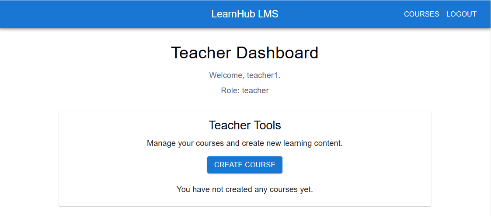

---

### Green Enrolled Button State

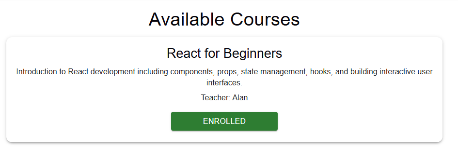

---

### Centered Snackbar Feedback

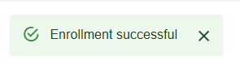

---

## Testing

The application was tested using:

- CRUD workflow testing
- Authentication testing
- Enrollment testing
- Responsive layout testing
- Lighthouse accessibility testing
- Production build testing

---

## Future Improvements

- Course search functionality
- User profile management
- Progress tracking
- File uploads
- Instructor analytics
- Course categories

---

## Author

Alan Baum
